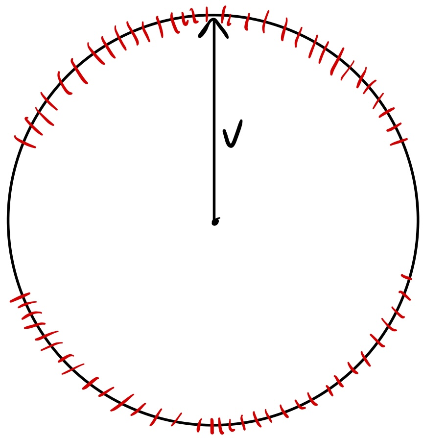

+++
title = "The Blessing of Dimensionality"
date = 2025-12-09
description = "Or: why we can fit so many nearly-orthogonal vectors into high dimensional spaces"
+++

An often assumed fact in ML is this: you can fit a lot of nearly-orthogonal things into high
dimensional spaces.

Why is this important? To give one example, the residual stream in LLMs always seemed unintuitively
small to me. How is it that GPT-2 XL, a model capable of grammatically correct and generally
coherent text across a variety of topics, has an embedding dimension of only 1,600? This is the space
responsible for representing everything the model knows about a given word in its context. Naively,
one could see that there are at least 1,600 separate and unrelated concepts in the English language,
not to mention ways that tokens could relate to each other in context.

In this post, I'll go over a proof of this claim as well as develop some intuition for higher
dimensional spaces. If you don't care about the proof, you can skip it and the intuition should
still make sense.

## The naive view
First, let me address the naive view expressed in my example. The largest set of pairwise
orthogonal vectors in a $d$-dimensional space is indeed $d$, by definition of a basis in linear
algebra. Thus, we can have at most $d$ mutually orthogonal vectors
in $\mathbb{R}^d$.

## What does _nearly orthogonal_ mean?
I used the term "nearly-orthogonal" earlier without defining it. Let's define two vectors $x$ and
$y$ as nearly orthogonal if the angle between them, $\theta$, is within $\epsilon$ of $\frac{\pi}{2}$.
So we have

$$
\theta \in \left(\frac{\pi}{2} - \epsilon, \frac{\pi}{2} + \epsilon \right)
$$

for some small $\epsilon > 0$. Now if $\epsilon$ is small, we can approximate $\cos{\theta}$ as
$\frac{\pi}{2} -\theta$ near $\frac{\pi}{2}$. Thus we can say 

$$
\theta \in \left(\frac{\pi}{2} - \epsilon, \frac{\pi}{2} + \epsilon \right) \Longleftrightarrow
\left| \cos{\theta} \right| < \epsilon.
$$

Now applying the definition of cosine similarity, we get

$$
\cos{\theta} = \frac{x \cdot y}{\Vert x \Vert \Vert y \Vert}.
$$

Thus, following our definition, $x$ and $y$ are nearly orthogonal for a fixed $\epsilon$ if

$$
\frac{\left| x \cdot y \right|}{\Vert x \Vert \Vert y \Vert} < \epsilon.
$$

This is equivalent to saying that $x$ and $y$ are at most $\epsilon$ radians away[^1] from being orthogonal.

## The proof
I'll now prove that for any $\epsilon \in (0,1)$ and for any dimension $d$, there exists a set $A$
of $t$ vectors in $\mathbb{R}^d$ such that

$$
\forall x_i,x_j \in A^2 : i \neq j, \quad \frac{\lvert x_i \cdot x_j \rvert}{\lVert x_i \rVert \lVert x_j \rVert} 
< \epsilon.
$$

I'll prove this probabilistically (with structure borrowed from [Rajesh Jayaram](https://rajeshjayaram.com/lectures/lec3.pdf)). This means that we'll draw our set from a probability distribution and then
show that there is a > 0 probability that the above condition holds, which means that such a set
does indeed exist.

We start by constructing our set $A = \{ x_1, x_2, \dots, x_t \}$ so that each coordinate is set to
$\frac{\pm 1}{\sqrt{d}}$ randomly. This gives us that

$$
\mathbb{E}[x_i \cdot x_j] = 0
$$

because each coordinate is either $\frac{1}{\sqrt{d}}$ or $\frac{-1}{\sqrt{d}}$ with equal probability.
We also have that

$$
\begin{align}
\text{Var}[x_i x_j] &= \sum_{k=0}^d \text{Var}[x_{i,k} x_{j,k}] \\\\
&= d \text{Var}[x_{i,0} x_{j,0}] \\\\
&= d \cdot \frac{1}{d^2} \\\\
&= \frac{1}{d}
\end{align}
$$

by independence of each of the coordinates. Now, we want to apply a [multiplicative Chernoff bound](https://en.wikipedia.org/wiki/Chernoff_bound).
To do this, we need to convert our dot product of $x_i$ and $x_j$ into a transformation of a Bernoulli
random variable. First, let's define for convenience

$$
\begin{gather}
C_k := x_{i,k} \cdot x_{j,k}, \\\\
Z := \sum_{k=1}^d C_k = x_i \cdot x_j.
\end{gather}
$$

Now we can define $C_k$ in terms of $B_k$, a Bernoulli random variable:
$$
C_k = \frac{2}{d} \left(B_k - \frac{1}{2} \right).
$$

We can use this to calculate $Z$ in terms of $B_k$:
$$
\begin{align}
Z &= \sum_{k=1}^d C_k \\\\ 
&= \frac{2}{d} \sum_{k=1}^d \left( B_k - \frac{1}{2} \right) \\\\
&= \frac{2}{d} \left( \sum_{k=1}^d B_k - \frac{d}{2} \right).
\end{align}
$$

Now we can finally apply our Chernoff bound:

$$
\begin{align}
P(|Z| \geq \epsilon)
&= P \left( \left| \frac{2}{d} \left( \sum_{k=1}^d B_k - \frac{d}{2} \right) \right| \geq \epsilon \right) \\\\
&= P \left( \left| \sum_{k=1}^d B_k - \frac{d}{2} \right| \geq \frac{d}{2} \epsilon \right) \\\\
&\leq 2e^{-\epsilon^2 d / 6}.
\end{align}
$$

This is a big result! This means that for any given pair of $x_i, x_j$, the probability of them being
nearly orthogonal is at least $1 - 2e^{-\epsilon^2 d / 6}$. But, we don't care about the probability
of individual pairs of vectors being orthogonal; we care about whether our entire set of $t$
vectors are all pairwise nearly orthogonal. To get a bound on this, we can apply a union bound.

$$
P( \forall i,j: i \neq j, \quad x_i \cdot x_j < \epsilon) \geq 1 - \binom{t}{2} 2e^{-\epsilon^2 d / 6}.
$$

We want to prove that such a set of $t$ vectors exists, so we want to know under what conditions the RHS
is positive. Let's check:

$$
\begin{align}
1 &> \binom{t}{2} 2e^{-\epsilon^2 d / 6} \\\\
1 &> t(t-1) e^{-\epsilon^2 d / 6} \\\\
e^{\epsilon^2 d / 6} &> t(t-1).
\end{align}
$$

This would be a little messy to solve explicitly, but we can easily lower bound $t$, which will be
good enough.

$$
e^{\epsilon^2 d / 6} \geq t^2 \Longrightarrow e^{\epsilon^2 d / 6} > t(t-1),
$$

so we can say that any $t \leq e^{\epsilon^2 d / 12}$ will work.

Therefore, we can say that for any given $\epsilon \in (0,1)$ and $d \in \mathbb{N}$, there exists
a set of at least $t = e^{\epsilon^2 d / 12}$ mutually nearly-orthogonal vectors in $\mathbb{R}^d$.
This is pretty cool since it shows that we get exponential scaling, even for small values of
$\epsilon$.

## The intuition
It's hard (at least for me) to develop intuition for reasoning in high dimensional spaces, since
you can't easily visualize anything above $d=3$.

One way to think about packing vectors into a $d$-dimensional space is to have each vector
"block off" a portion of the space that other vectors cannot occupy, without breaking the
"nearly orthogonal" principle. Again, let's restrict ourselves to the unit sphere, since magnitude
doesn't matter for the purpose of cosine similarity.

I've visualized what this looks for a circle below, which is unfortunately the limit of my drawing
abilities. In 3 dimensions, you can imagine a "cap" on the top and bottom of a ball.

Now, one might wonder how much of the unit sphere is blocked off by a single vector and how this
number changes as $d$ changes. Let's compute that. The surface area of a $d-1$ dimensional unit
sphere (i.e. a sphere embedded in $d$ dimensional space) is given by

$$
S_{d-1} = \frac{2 \pi^{d/2}}{\Gamma(d/2)}.
$$

And we can scale this for non-unit radius spheres by scaling by a factor of $r^{d-1}$:

$$
S_{d-1}(r) = \frac{2 \pi^{d/2}}{\Gamma(d/2)} r^{d-1}.
$$

Now we compute the surface area of the "caps" for a given $\epsilon$ and $d$:

$$
C_{d-1} = 4 \int_0^{\frac{\pi}{2} - \epsilon} \frac{2 \pi^{(d-1)/2}}{\Gamma\left(\frac{d-1}{2} \right)} \sin^{d-2} (\theta) d \theta.
$$

Note that the surface area for the whole sphere can also be given by:

$$
S_{d-1} = 2 \int_0^{\pi} \frac{2 \pi^{(d-1)/2}}{\Gamma\left(\frac{d-1}{2} \right)} \sin^{d-2} (\theta) d \theta.
$$

Combining these to get the ratio of "blocked off" area w.r.t. total area, the value falls out nicely after
eliminating common constants:

$$
R_{d} = \frac{C_{d-1}}{S_{d-1}}
= \frac{2 \int_0^{\frac{\pi}{2} - \epsilon} \sin^{d-2}(\theta) d \theta}{\int_0^{\pi} \sin^{d-2}(\theta) d \theta}.
$$

Unfortunately, this is still really annoying to compute by hand, so I'll just compute it via Python
with $\epsilon = 0.1$.

Be careful interpreting this chart. For instance, note that with $\epsilon = 0$, $R_d = 1$ for every
value of $d$, even though we know that we can pack $d$ orthogonal vectors into $\mathbb{R}^d$.
There's two reasons why this isn't a contradiction:

1. Even after blocking off 100% of the surface area, there's still the hypercircle orthogonal to $v$
where you can place new orthogonal vectors. For instance, visualize a sphere with $v$ at the north
pole. There's still two more orthogonal vectors that we can place in the orthogonal hypersphere.

2. Blocked off areas can intersect, as long as the vectors themselves don't lie in another vector's
blocked off zone.

However, that said, I think this is still a good visualization for building intuition into how big
high dimensional spaces are.

 

[^1]: This approximation is incorrect for larger values of $\epsilon$ since we can't approximate
$\cos \theta$ as $\frac{\pi}{2} -\theta$ in these cases.
