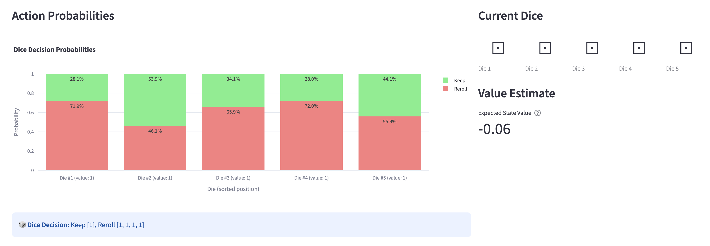

+++
title = "Training a Yahtzee Agent with Reinforcement Learning"
date = 2026-01-05
description = "The challenges, lessons, and surprising complexity of training PPO for Yahtzee"
+++

I love Yahtzee and I'm trying to learn more about reinforcement learning, so I decided I would create a Yahtzee agent and train it using RL. This ended up being surprisingly difficult, so I've written up the journey here.

As a side note before we get started, I know that optimal Yahtzee can be solved via dynamic programming, but I wanted to do this as a learning exercise anyway. I also wanted to use this as an opportunity to try out Opus 4.5 on a big project and see what all the hype was about. 

Because I was most focused on learning about RL and PPO, I wanted to train this model in as black-box of a way as possible. As such, I didn't implement any reward shaping here. 

This post is about the process of building my Yahtzee agent. I'll go through each aspect of the project, how it evolved over time, and what I learned. If you are looking for a description of the code, how to use it, or results, check out [the repo](https://github.com/noahrossi/rl-yahtzee).

## The observation space
For the observation space, we need at a minimum the following information:
* Which categories have been scored already
* The state of the dice
* The current roll number (i.e. 1, 2, or 3)

For my first attempt, I created a 46d observation space that included the following:
* a 6d one-hot vector for each die (30d total)
* a 13d vector representing the scorecard. -1 represented an empty spot and 0+ represented the score of a filled spot
* a 3d one-hot roll count vector

I quickly realized that it would be much better to provide a sorted list of one-hot dice vectors. This way the network doesn't have to learn permutation invariance on its own (e.g. that `11112` is equivalent to `21111`). This provided a huge training speedup.

I also separated out the scorecard into two observations: a 13d one-hot vector representing which spaces were filled, and a single value representing the upper section progress. The original idea of using `-1` as a "sentinel" value makes sense in the programming world, but I figured it didn't make much sense for a neural net, since it was representing something different entirely from the score.

I also ended up eventually normalizing the upper section bonus by dividing by 63. Every other value was already between 0 and 1, so I didn't feel the need to normalize them.

Finally, I added a normalized turn progress observation (turns_completed / 13) to make progress through the game more obvious. I'm not sure that this is necessary (see the proposed ablation in next steps).

## The agent, actions, and rewards
These three aspects of the project were intertwined, so I'll talk about them together.

I started with StableBaselines3's PPO for the policy. I didn't want to spend a long time debugging the RL training loop itself, so I figured it made sense to start with something proven.

For the action space, things are a bit more complicated than the observation space. We need to be able to both score or re-roll on rolls 1 and 2. However, on roll 3, we can only score, not re-roll. To start with, I created a `Discrete(45)` action space consisting of 32 keep/reroll combinations (2^5) and the 13 different categories that we could score. This was a terrible choice in retrospect!

Because of the fact that I didn't mask off invalid actions (e.g. trying to re-roll on roll 3), I needed to provide some incentive against invalid moves. I initially chose a strong negative reward (-500) and to immediately terminate the episode in these cases. This was a mistake because the agent spent most of its time trying to figure out how to follow the rules instead of learning to maximize its score.

After reading a little more into the docs, I found `MaskablePPO`, which did exactly what I wanted it to do: disable some actions under certain conditions and distribute its probability proportionately to the other actions. With this, I could finally remove the invalid move reward, and the network could focus on learning to maximize its score.

However, upon closer inspection, there was still one big problem. I was treating each combination of re-rolls as a discrete event, but that's not true. Re-rolling dice 1 and 2 is somewhat similar to just re-rolling die 1, and I wanted my action space to reflect that. Ideally, this should improve training efficiency. I switched the action space to `MultiDiscrete([2,2,2,2,2,14])`. Note the 14 dimensions in the scoring space. It's not possible to mask off every single action for a dimension in a `MultiDiscrete` space using `MaskablePPO`, so I had to create a new "keep rolling" score action.

Unfortunately, we're still not done. As you may remember, during roll 3, the agent is not allowed to re-roll. Unfortunately we face the same restriction from earlier, where we can't mask off every action in a dimension. When all actions in a dimension are masked, the softmax outputs uniform probabilities, meaning we backpropagate gradients from random noise rather than meaningful policy decisions.

To fix this, I changed our network to a custom dual-head architecture:
```
Observation (48-dim)
       │
       ▼
┌─────────────────────┐
│  Feature Extractor  │
│    Linear(48→128)   │
└─────────────────────┘
       │
       ▼
┌─────────────────────┐
│    MLP Backbone     │
│   [256, 256] ReLU   │
└─────────────────────┘
       │
       ├────────────────────┬─────────────────────┐
       ▼                    ▼                     ▼
┌─────────────┐    ┌──────────────┐     ┌──────────────┐
│  Dice Head  │    │ Category Head│     │  Value Head  │
│ Linear→10   │    │  Linear→13   │     │  Linear→1    │
└─────────────┘    └──────────────┘     └──────────────┘
       │                    │
       ▼                    ▼
  [2,2,2,2,2]          Discrete(13)
  (Rolls 1-2)          (Roll 3)
```

For rolls 1-2, the dice head is used, and the category head is used for roll 3. This means that the network can't score early, but it can effectively do this by keeping all 5 dice. Because of this, we can get rid of the 14th "keep rolling" action in the score action space.

## Hyperparameter tuning
There are a lot of hyperparameters in RL, and I wanted to make sure I was using optimal parameters. One parameter was easy: $\gamma$ should always be 1 since we want to maximize the score of the total game without any discounting future rewards. But this still leaves us with GAE $\lambda$, net arch layers, net arch dim, feature dim, ent coef, vf coef, minibatch size, and number of steps between gradient updates.

For the rest, I used Optuna to run a sweep over possible hyperparameters. Optuna has a bunch of cool features, including a smart sampler that uses results of previous runs and early termination of unpromising runs.

## Results and next steps
After all of this, I'm able to train an agent that gets to a mean score of around 210. This is good, but far from the mean of an optimal agent (~250). I can also see via my debugging tool that the policy fails to correctly score Yahtzees under certain training conditions, so there's certainly room for growth.

For next steps, I would like to try:
1. Upsampling the number of Yahtzees and other rare events early in training. I tried this previously when I was having difficulty getting the network to correctly score Yahtzees, and it worked pretty well.
2. Scaling hyperparameters during the course of the training run. I already did some of this manually by loading models and increasing the GAE $\lambda$ and decreasing the entropy coefficient as training went on, but it would be nice to have this automated.
3. Implement the Yahtzee bonus. I didn't even bother with this yet, since I wasn't even able to get Yahtzees consistently correctly scored.
4. Running an ablation on some of my improvements after I get a near optimal agent. I want to know if a one-hot dice implementation is really that much better than a "dice count" implementation, if I really need the `turn_progress` observation dimension, etc.

## Lessons and reflections
### Observability and debugging tools are important
At one point, I had changed the observation space to dice counts but kept the action space using indices. This meant that choosing which dice to keep was essentially a shot in the dark each time, but the bug wasn't obvious to me at the time; I just saw the mean reward plateauing around 150 and assumed there was an issue with my model architecture or the training process.

Since I was stuck, I finally decided to build a debugging tool that could show me probabilities of each action given an observation. Here's an example of what it showed:



After seeing this, I quickly realized that the model was not picking re-rolls well, and it was easy to see why.
The model was just randomly picking indices since it had no idea which die value belonged to which index.

In a world where it's extremely easy to have an LLM build a functional observability tool and the benefits are so high, there's no reason not to.

After manually inspecting model behavior, I would add new metrics to my logging setup to monitor how my changes were affecting subtle model behaviors. For instance, I would frequently watch `P(score yahtzee | [1,1,1,1,1])` and `pct_upper_section_bonus` metrics, which were behaviors that I found the model had a hard time learning.

### Why was this so hard?
I have a few ideas here. First, the unique structure of the re-roll or score actions makes structuring the action space difficult. Also, Yahtzee is a fairly high-variance game. Yahtzees are rare, creating a reward sparsity problem. Finally, playing Yahtzee well requires both a greedy understanding of the game (what can I get the most points for now) as well as long term planning (could I do better with this space in the future).

### Opus 4.5 is really great
One of the goals of this project was learning to use Claude Code with Opus 4.5 and getting a feel for what it was capable of. I found that it generally made good design decisions, but I especially appreciated that it now has a good sense of when to ask the user for input on big design decisions.

While it is better than ever on writing code and even design patterns, I found that Opus was still pretty clueless as to some of the RL and machine learning specifics. For instance, Opus suggested including `gamma` in the hyperparameter tune, which doesn't make sense because Yahtzee is a finite-length game and we want to optimize the total score. It also strangely suggested at one point waiting until the very end to award the total score as a reward, which would surely slow down training since it makes attributing actions to rewards even more difficult. At least this all leaves something for me to do!
